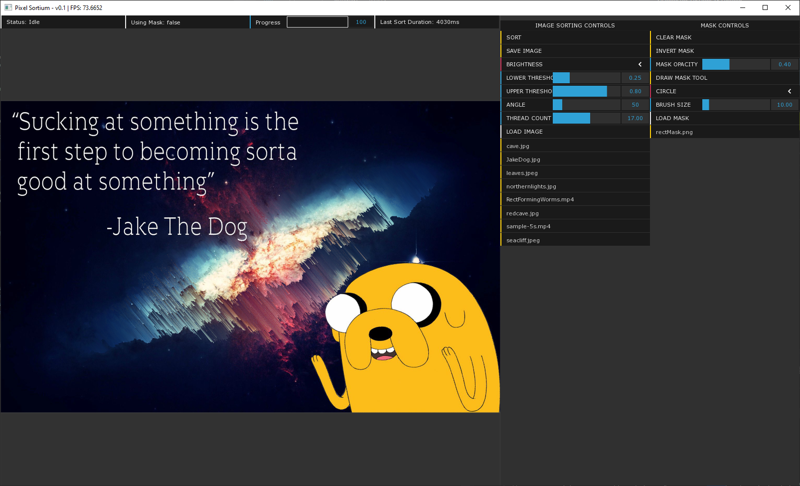

# Pixel Sorting

### What is pixel sorting?

In short, pixel sorting is taking an interval of pixels in a row or column from an image and sorting them based on some criteria.

The intervals can be determined arbitrarily, such as seleccting all consecutive pixels under a certain brightness threshold, and then sorting them by some property such as brightness values.

For more details and a visual explanation check this blog post by satyarth [here](http://satyarth.me/articles/pixel-sorting/).

### Why make this program?

satyarth has already created a comprehensive [command line tool](https://github.com/satyarth/pixelsort) written in Python to perform pixel sorting on images. 
I wanted to be able to easily apply pixel sorting to videos files but that would require a lot of manual work using existing tools. 

Additionally, I wanted to implement multithreading on the pixel sort algorithm to speed it up which will be especially useful for sorting long videos.
The single threaded python application can sort a 1920x1200 image at a 45 degree angle with thresholds set from 0.25 - 0.8 (default parameters) in about 17 seconds.
This c++ multithreaded application can perform the same sort on the same image in 4.5 seconds while showing the image as its being sorted and allowing for rapid iteration.

I also wanted to created an application with a gui to give more immediate visual feedback to the user and add other tools such as mask drawing in app.

### Dependencies

This application uses [OpenFrameworks](https://openframeworks.cc/) and c++ for the pixel sorting, image loading, and video loading/playback.
[OpenCV](https://opencv.org/) is used to take the modified pixels from each frame and collect them into an .mp4 file

### Usage

This application is still in development. I plan to publish some iterations in the Releases section when the code is in a more user friendly state.
Documentation and a walkthrough video will be made as well.

Initial release is very close!

### Supported file types

The supported files types are based on the underlying libraries used by OpenFrameworks and OpenCV.
(NOTE: If you want to load and sort video files then you need to install the [K-Lite codec pack (basic)](https://codecguide.com/download_kl.htm))

Images (from [FreeImage](https://freeimage.sourceforge.io/features.html) library):
png, jpg, jpeg, jp2, bmp, tif, tga, pcx, ico

Videos (from [K-Lite](https://codecguide.com/download_kl.htm) codec pack):
AVI, MKV, MP4, FLV, MPEG, MOV, TS, M2TS, WMV, RM, RMVB, OGM, WebM

I have verified all the listed image types are supported but have only verified MP4 and MKV video file types personally.

### Caveats

Click to expand

In order for an image to be sorted at any angle, each image pixel needs to be rotated within a 2D matrix. Since contents of a 2D matrix cannot be cleanly rotated at anything other than 90, 180, or 270 degrees, the 'warpAffine' function
used by OpenCV will perform some color interpolation on the pixels to make the rotated image retain the same dimensions and all have the pixels still be adjacent to each other. After the sorting is performed, when saving an image, it must be rotated back to a 0 degree orientation.
These multiple rotations will cause the image to become slightly blurred (not very noticable though) and there may be some color artifacts at parts of the image borders. Additionally, these rotations increase the time it takes for each sort. This can signficantly increase the time required to
sort a video as each frame must be rotated, sorted, and then rotated back to be saved to the new video file.

None of the above issues apply when sorting an image at 0 degree angle (default, horiztonal)

---

When sorting images it is recommended to have at least 1GB of RAM (2GB for 4k images). If sorting videos you may need significantly more RAM (4GB, 8GB depending on the size of the video file)

Sorted video files seem to be significantly larger in memory than the unsorted version of the video (6.7MB -> 70MB). This is known issue with OpenCV video writer although I plan to look into ways to minimize this increase in size.

As of now a video file can only be sorted in one go, start to finish (or until you press "Stop"). If you computer shuts off, goes to sleep, or for any reason any issue occurs during the sorting, the whole *new* video file will be corrupted and the sorting process will need to restart (the original file will not be corrupted)
In the future I would like to add the feature of sorting the video in segments and stitching the together at the end so if any issue occurs it will be contained to the current segment.

If the following error is displayed when trying to launch the executable, then latest version of Microsoft c++ redistributable 2015-2019 needs to be installed:
The code execution could not proceed because (LIBRARYNAME).dll was not found. Reinstalling the program may fix the problem.

### Remaining items before initial release:
  * Fix mask saving filename
  * Stop sorting when loading a new image
  * Include default video and mask for testing and demonstration purposes
  * Write documentation and create walkthrough video

### Todo List

* Enhance masking functionality
  * Use mask as intervals
  * Improve performance of mask drawing
  * Add ability to use any image as a mask with threshold customization
  * Write fragment shader to display what intervals will be sorted, dynamically as thresholds are modified
  * Add color pickers to modify mask color, angle arrows (default of white is not visible on white portions of images)
* Improve UI clarity and usability
  * Add diagnostics and metrics to be shown in app (time taken, current frame for videos, what the application is currently doing, error messages, tooltips)
  * Using mask, last sorting time, what its currently doing,  est time to completion, percentage complete
  * Make a better icon: [Guide](https://forum.openframeworks.cc/t/how-to-get-rid-of-console-and-set-proper-app-icon/24227/2)
* Add undo/redo functionality
* Video improvements
  * Allow saving video files to desired format (default is mp4 now regardless of input video format)
  * Reduce size of sorted video files. It is a [known behavior](https://www.quora.com/Why-is-that-when-I-read-an-mp4-video-using-OpenCV-re-write-it-using-OpenCV-the-size-of-the-rewritten-video-is-greater-than-original-video) that OpenCV VideoWriter will drastically increase size of videos
  * Add ability to scrub through videos to select start and end frame, see what intervals will be sorted at that frame
  * Break up video sorting to multiple files and concatenate them all at the end so in the case of any issues not all progress is lost
  * Add ability to apply curves or easing functions to parameter values to change them over the course of a video sorting
* Look into Mac and Linux support
* Refine sorting algorithm to improev performance

### Examples

