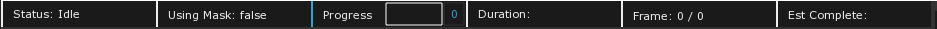
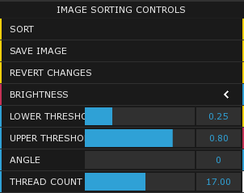
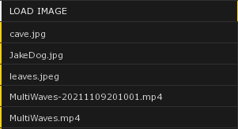
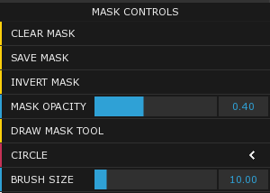

# Pixel Sortium Documentation v0.1

### What is pixel sorting?

In short, pixel sorting is taking an interval of pixels in a row or column from an image and rearranging or sorting them based on some criteria.

The intervals can be determined arbitrarily, such as seleccting all consecutive pixels within a certain Brightness window, and then sorting them by some property such as brightness values.

For more details and a visual explanation check this blog post by satyarth [here](http://satyarth.me/articles/pixel-sorting/).

### System Requirements

- Windows 64-bit OS
- Latest version of [Microsoft Visual C++ Redistributable 2015-2019](https://docs.microsoft.com/en-US/cpp/windows/latest-supported-vc-redist?view=msvc-170)
- At least 2 GB of RAM for soritng images. At least 4 GB RAM for sorting videos (although more may be required for large video files)
- Install [K-Lite Codec](https://codecguide.com/download_kl.htm) pack (only required if sorting video files)

### Installation

* Download the zip folder in the Releases section.
* Unzip the folder to a location on your computer.
* Open the folder
* All images and videos you want to be able to load into the application will need to be placed in the `data/images` folder (this can be done when the application is open as well)
* All mask images will need to be placed in the `data/images/masks` folder
* At the base folder double click the PixelSortium.exe file to launch the application

### Error on start up

If you encounter the following error when launching the app: `The code execution could not proceed because (LIBRARYNAME).dll was not found. Reinstalling the program may fix the problem.`

This is caused due to not having the latest version of [Microsoft Visual C++ Redistributable 2015-2019](https://docs.microsoft.com/en-US/cpp/windows/latest-supported-vc-redist?view=msvc-170) installed

----

If you try to launch this application on Mac it will say that the application cannot run on Mac. As of now the only release available works on Windows but I would like to support Mac in the future.

### Usage

At the top of the screen you will see some diagnostic information.

**Status** : Provides information for what the application is currently doing. (Idle, Sorting, Loading Image, Rotating Image). 
This can be useful if the application is currently doing something but it is not obvious (such as performing a sort with parameters that do not actually change the image)

**Using Mask** : Indicates if any mask data is being used during the sorting process. If the mask opacity slider is set to 0% then you cannot see the current mask data. This indicator can help you determine why your sort did not behave the way you expected if you have forgotten about the active mask data

**Progress** : Indicates the progress for sorting the current image after *Sort* has been pressed. When sorting video files it indicates sorting progress for the current frame.

**Duration** : Indicates in milliseconds the amount of time taken to complete the last executed sort. 

**Frame** : Indicates the current frame of total frames in the currently sorted video. If an image is currently loaded then it will always display 0 / 0

**Est Complete** : Estimate in minutes and seconds for when the current video file will be finished sorting. This is very rough since the average sorting time per frame can vary greatly depending on parameter values and the content of the frame itself

### Sorting Parameters

On the right side of the screen you will see two UI columns. The column on the left contains parameters for sorting and files which can be loaded

**Sort/Stop** : This button kicks of the sorting process on the curently loaded image/video. While sorting is running the button changes to a **Stop** button which allows you to halt the current sort. 
When pressing the sort button again it will not continue where it left off. It will start from the beginning for both images and videos. The **Stop** button can be used to halt video sorting and it will finish encoding and close the pixel sorted video file.

**Save Image** : This is used to save the current pixels on screen to a new image in the `data/images` folder. The save format is FILENAME-{Year}{Month}{Day}{Hour}{Second} (ex SampleImage-20211116075411). 
This can be verbose but keeps the images sorted in order and ensures there are no conflicts. This button is not used for video file sorting since videos are saved when the last frame is sorted or sorting is stopped early by the user

**Revert Changes** : This button essentially loads the latest version of the file you have open. So if you load an image and sort it and then Revert it, the original file will be reloaded. If you sort an image and save it and then press Revert Changes nothing will happen since it will reload the last saved version (which is already open)

**Sorting Parameter** : Brightness (Default), Hue, Saturation. Parameter which determines pixel characteristic to compare when sorting.

**Lower Threshold** : The lower part of the threshold window when sorting pixels. If the sorting parameter is set to Brightness then if a pixel is to be considered for sorting it must have a Brightness value above the value of Lower Threshold

**Upper Threshold** : The upper part of the threshold window when sorting pixels. If the sorting parameter is set to Brightness then if a pixel is to be considered for sorting it must have a Brightness value below the value of Upper Threshold

**Angle** : The angle at which the image will be rotated before performing the sort. When changing the value of this parameter arrows will appear onscreen giving you a reference for the curent angle value

**Thread Count** : The amount of threads used when performing the sort. This multithreading is what speeds up the sorting process in the application. I have found the sweet spot to be 17 threads.

### Loading Images and Videos

**Load Image** : This list shows all the files in the `data/images` folder which are able to be loaded by the application. Supported file types are listed in the Supported File Types section of the documentation.
When clicking on one of the buttons in this list it will load the image of that name. Any current image or video will be lost so ensure that you have saved it before loading a new image.

If an image that is loaded is too large to fit in the current window size it will be scaled down to fit. This is just visual but the internal resolution remains the same.

### Mask Parameters

The right-most UI column contains parameters for masks and files which can be loaded:

**Clear Mask** : Clicking this button clears the mask of all data and indicates to the application that the mask should not even be referenced when sorting

**Save Mask** : This will save the current mask with the current mask data as an image with the format {FILENAME}Mask-{Year}{Month}{Day}{Hour}{Second}.png

**Invert Mask** : This will invert the current mask data. This can make it easy to apply sorting to one portion of the image, then invert change parameters and sort the other portion of the image

**Mask Opacity** : Changes the opacity of the current mask data. This is only visual and does not affect the sorting algorithm at all

**Draw Mask Tool** : Clicking this button will engage the draw mask tool (button turns green when on). When tool is on and you hover over the image you will see a red circle outline (default). 
The size can be increased and decreased by scrolling the mouse wheel. Left mous button draws mask data. Right mouse button erases mask data.

**Brush Type** : Circle, Square, Drag and Release. Drag and Release allows you to click and drag a rectangular area to either draw or erase mask data. This can be useful for blocking large portions of the image with mask data and then using a smaller circle brush to refine the edges.

**Brush Size** : Affects the circle and square brush types. Can be changed with the slider or the mouse wheel.

### Loading Mask Files

**Load Mask** : This list shows all files in the `data/images/masks` foler which are able to be loaded by the application. Supported file types are listed in the Supported File Types section of the documentation.
When clicking on one of the buttons in this list it will load the image of that name as a mask. The mask image resolution does not have to match the currently loaded image. If the mask image is smaller then extra empty pixels will be added to match the current image size. This allows you to draw mask data for all parts of the current image using the Draw Mask Tool.

### Supported file types

The supported files types are based on the underlying libraries used by OpenFrameworks and OpenCV.
(NOTE: If you want to load and sort video files then you need to install the [K-Lite codec pack (basic)](https://codecguide.com/download_kl.htm))

Images (from [FreeImage](https://freeimage.sourceforge.io/features.html) library):
png, jpg, jpeg, jp2, bmp, tif, tga, pcx, ico

Videos (from [K-Lite](https://codecguide.com/download_kl.htm) codec pack):
AVI, MKV, MP4, FLV, MPEG, MOV, TS, M2TS, WMV, RM, RMVB, OGM, WebM

I have verified all the listed image types are supported but have only verified MP4 and MKV video file types personally.

### Mask Details

Masks can be drawn, saved, and reused all within the application. However, in the case you want to import a custom mask file there are some things to consider.
The mask file must be placed in the `data/images/masks` folder. The masking data values are based on the Brightness of each pixel in the mask. Alpha values are not considered when reading the mask.

Currently, the threshold for pixels to count for masking is maximum (255 or 1.0 depending on the file type). 
This means that the masking area should be completely bright (easiest is pure white) and any area not masked should be less than pure white (easiest is black).

Below is a valid mask to import. The white area will be the only section considerd for sorting by the algorithm. The black area will be ignored by the algorithm:

### Sorting Videos

Sorting videos is similar to sorting images. You set the desired sorting parameters and mask parameters press **Start** and the video will be sorted frame by frame.

You can change the parameters while the video is being sorted and the modified parameters will take effect immediately (except angle change will take effect on next frame).

In order for the resulting video file to be usable it must be closed by the VideoWriter. The VideoWriter will close the file when the last frame is sorted or when the user presses the **Stop** button.

If the application process is interrupted for any reason (computer goes to sleep, force quitting the application window) the file will not be closed and will be unusable and unrecoverable.
The original video file will not be affected, just the new, sorted video file.

### Caveats

The application is still in development and there will likely be bugs. If you encounter any, please create a ticket in the [Issues](https://github.com/DavidMcLaughlin208/PixelSorting/issues)section in the Github repository.

The resulting pixel sorted video files will be significantly larger (7mb -> 65 mb) than the original input files. This is a [known behavior](https://www.quora.com/Why-is-that-when-I-read-an-mp4-video-using-OpenCV-re-write-it-using-OpenCV-the-size-of-the-rewritten-video-is-greater-than-original-video) of OpenCV VideoWriter. The best workaround is to use some program (like [VLC](https://www.videolan.org/)) to convert the video using a lossless encoding. 
This will reduce the file size but not back down to the same as the input file.

